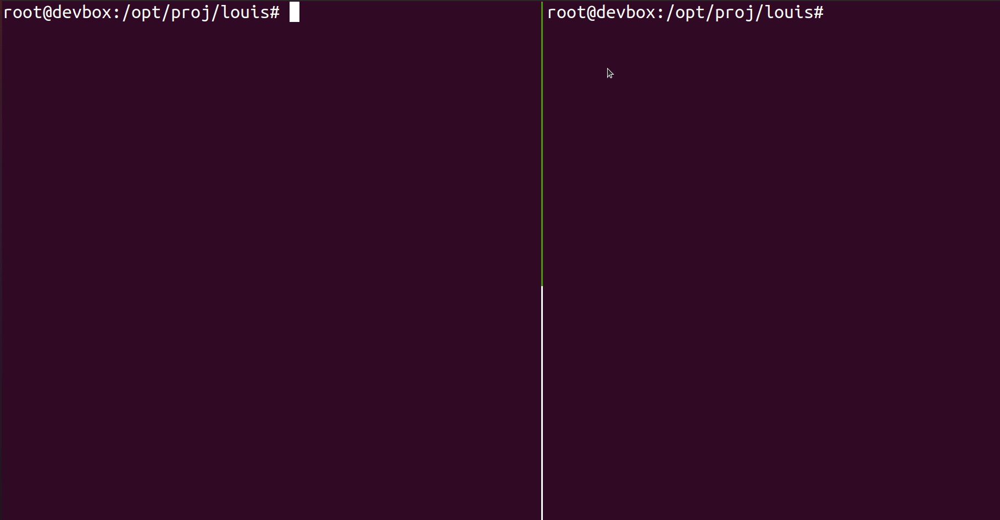

# louis

`louis` is a simple tool using eBPF to automatically detect and respond to malicious behavior on a Linux system.

## Usage

```
Usage:
  louis [command]

Available Commands:
  help        Help about any command
  hunt        hunt for existing malicious activity
  mitigate    mitigate all known vulnerabilities
  monitor     actively monitor for malicious action
  version     print louis version

Flags:
  -a, --active    counter detected malicious activity (dangerous, may clobber)
  -h, --help      help for louis
  -s, --syslog    output to syslog
  -v, --verbose   enable verbose output

Use "louis [command] --help" for more information about a command.
```

## Information

louis gathers information from the kernel through eBPF (with BCC). These sources are analyzed with information from categorized techniques and vulnerabilities.

```
                                                +------------+
                                                |            |
                                                | CLI Output |
                                                |            |
                                                +--------+---+
                                                         ^
                   +-------------------------------------|------+
                   |                                     |      |
+--------+         | +---------+    +----------+     +---+---+  |
|        |         | |         |    |          +---->+       |  |
|        |         | | Sources +--->+ Analysis |     | louis |  |
|        |   eBPF  | |         |    |          |     |       |  |
| Kernel +---------->+ Sockets |    +----------+     +--+----+  |
|        |         | | Users   |               ^        ^       |
|        |         | | Proc... |    +-------+  |        |       |
|        |         | |         |    |       |  |        v       |
+--------+         | +---------+    | Techs +<-+    +---+----+  |
                   |                |       |       | Output |  |
                   |                +-------+       +--------+  |
                   |                                            |
                   +--------------------------------------------+
```

> There is no kernelspace component (other than the eBPF data-gathering code), which means `louis` is more susceptible to resource exhaustion and various types of executable manipulation. However, if that happens, you'll probably know about it.

## Installation

1. Ensure [BCC](https://github.com/iovisor/bcc) is installed.
    ```
    sudo apt-get install bcc
    sudo apt-get install ibbpfcc-dev
    ```
2. Install `louis`.
    - Clone this repository and build the binary (requires Go):
        ```
        git clone https://github.com/sourque/louis && cd louis && go build
        ```
    - Or download the `louis` binary from releases.

## Screenshots & Examples



## Fun future activities

- New Sources
    - eBPF additions
    - pam authentication
    - file permission changes (for sensitive dirs (tmp) and creating new bins/suid/sgid)
- Techs/threat actions
    - sendlines per <time unit> (bash)
    - time between shell spawn and sending commands (maybe)
    - connect() (detect if being scanned)
- Fixes
   - Pwd incorrectly reports absolute path when in mounted/chrooted environment (ex. tmux)
   - Race condition in bcc code? Imagine one open syscall on the same pid starts before another, and ends after -- details would be overwritten?

## Prior Art

- https://github.com/falcosecurity/falco well-made tool with a similar purpose and design. primarily c++. large backing by sysdig
- https://github.com/ION28/BLUESPAWN similar tool for Windows, made by very talented & welcoming devs
- https://github.com/D4stiny/PeaceMaker Windows heuristic monitoring tool made by a local cyber genius

## eBPF Resources and Libraries

- https://github.com/iovisor/gobpf
- https://github.com/iovisor/bcc
- http://www.brendangregg.com/Perf/bcc_tracing_tools.png
